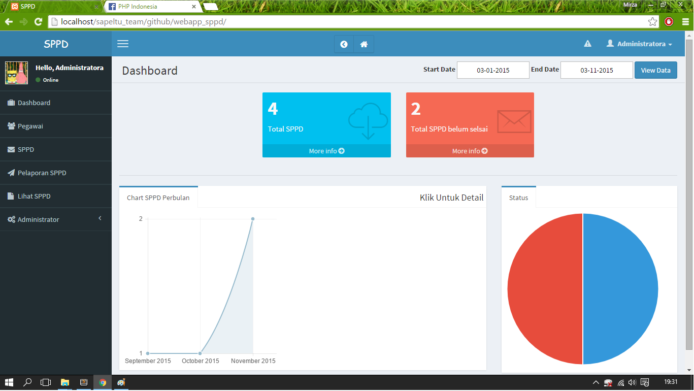
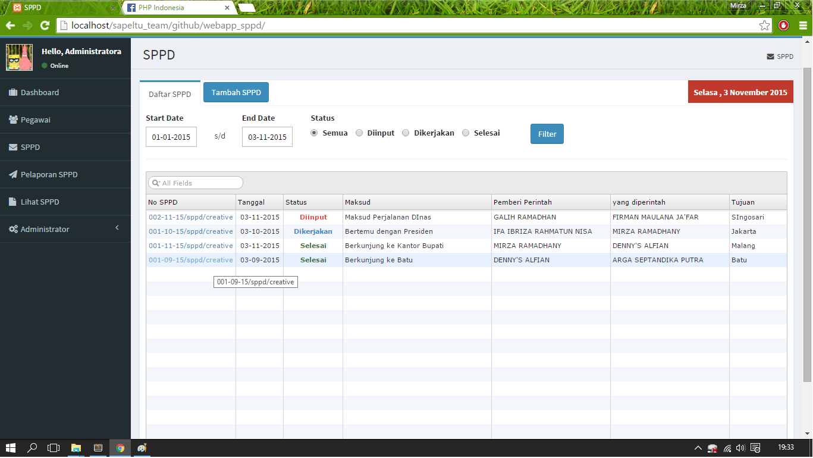
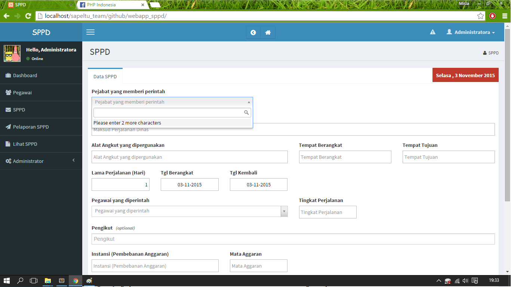
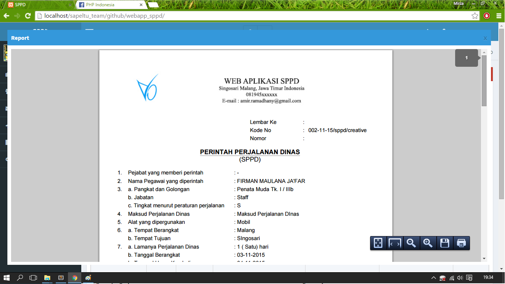

# webapp_sppd

<h3>SURAT PERINTAH PERJALANAN DINAS</h3>
<b><i>Detil Aplikasi :</i></b>
<ol>
	<li>Input SPPD </li>
	<li>Cetak SPPD (pdf)</li>
	<li>Pelaporan SPPD yang dilakukan oleh petugas </li>
	<li>Cetak Hasil Laporan SPPD (pdf)</li>
	<li>Daftar semua SPPD (sedang dikerjakan, selesai , dan belum dilaporkan)</li>
	<li>Chart SPPD Perbulan</li>
</ol>

<b><i>Aplikasi dapat diinstall pada :</i></b>
<ol>
	<li>XAMPP v.1.8.3</li>
	<li>
		Ubuntu Server 12.04 
		<ol>
			<li>PHP 5.5</li>
			<li>Mysql 5</li>
			<li>Apache</li>
		</ol> 
	</li>
</ol>

<b><i>Cara Instalasi :</i></b>
<ol>
	<li>Copy pada folder /var/www (untuk ubuntu) / htdoc (untuk xampp)</li>
	<li>chmod 777 -R pada folder /uploaded , /tmp , /thumbs</li> 
	<li>Import database github_sppd.sql</li>
	<li>Setting user passowrd mysql pada /system/sc.ini.php</li>
	<li>User : 
		<ul>
			<li>user : admin</li>
			<li>pass : appbismillah</li>
		</ul>
	</li>
</ol>  

<b><i>Screenshot</i></b>
<table border="0" style="border:0" cellpadding="0" cellspacing="5">
	<tr>
		<td style="width:50%"></td>
		<td style="width:50%"></td>
	</tr>
	<tr>
		<td style="width:50%"></td>
		<td style="width:50%"></td>
	</tr>
</table>